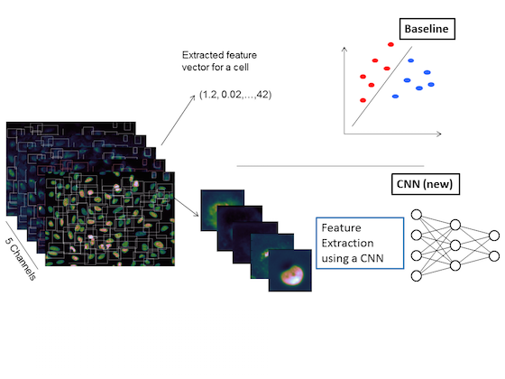

## Deep Learning for HCS

In high content phenotypic screening millions of cells need to be classified based on their morphology. Images of the cells are taken at different 5 'color channels' using different fluorescent markers. 

 

In this project we compared the conventional pipeline (upper branch) against a deep learning approach (lower branch). For the deep learning approach the construction of appropriate feature definitions is part of the training. Whereas, in the traditional pipeline expert knowledge is required for the tedious creation of handcrafted features. Compared to the best traditional method, the misclassification rate in the deep learning approach is reduced from 8.9% to 6.6%.

For more information: See our 
[Poster](https://www.researchgate.net/publication/293817013_Deep_learning_A_novel_approach_to_classify_phenotypes_in_high_content_screening) and [talk](https://dl.dropboxusercontent.com/u/9154523/talks/SIBS2015_final_as_hold.pdf) at the  [SIBS 2015 in Basel](https://www.sibs2015.ethz.ch/) or have a look at out paper: [Dürr, O., and Sick, B. Single-cell phenotype classification using deep convolutional neural networks. Journal of Biomolecular Screening (2016)](http://jbx.sagepub.com/content/early/2016/02/11/1087057116631284.abstract).

