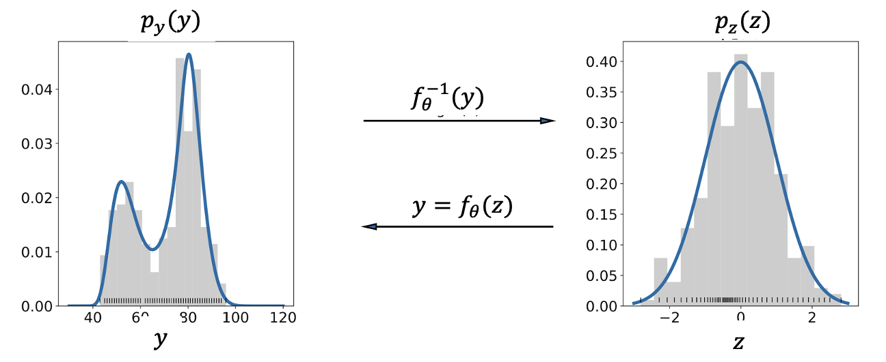

## Neural Transformation Models (one hammer 🔨 for many nails )
A valuable way to describe a probability distribution is by considering it as a transformation from a basic distribution to a complex. Collaborating with Beate Sick and other colleagues, we employ networks to determine the parameters θ of a transformation function since 2020 and have found it to be a versatile tool for many applications. 

     
 

* To create a flexible output distribution for a neural network (NN):
    * We introced this concept in  using it to predict the age of a person based on an image. 
    * To model the [power consumption forecasted by a neural network](https://ieeexplore.ieee.org/abstract/document/10066318))

* For comprehensible integration of NN and interpretable coefficients:
   *  For [ordinal outcomes](https://www.sciencedirect.com/science/article/abs/pii/S003132032100443X)
   *  For [functional outcome prediction after acute ischemic stroke](https://onlinelibrary.wiley.com/doi/abs/10.1002/bimj.202100379)

* To model flexible distibitions for [variational inference](https://arxiv.org/abs/2202.05650)

* To model the functions of a structal causal model (in preparation)

