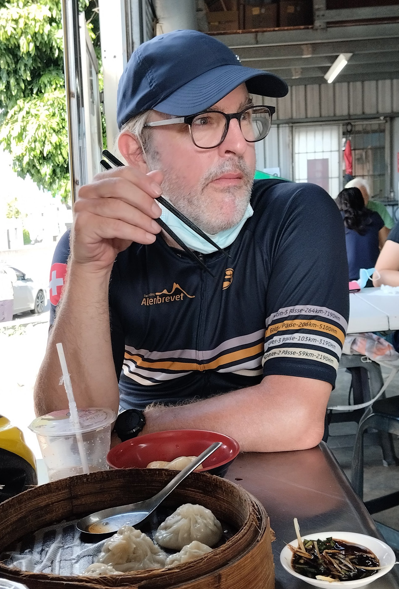

# Oliver Dürr

I am a theoretical/computational physicist by training and a professor of data science at the [University of Applied Sciences, Konstanz (HTWG)](https://www.htwg-konstanz.de/hochschule/fakultaeten/informatik/orga/professoren/duerr). I am also affiliated with the [Institute for Optical Systems (IOS)](https://www.ios.htwg-konstanz.de/) and serve as a co-director of the newly founded Thurgau Institute for Digital Transformation [TIDIT](https://www.htwg-konstanz.de/aktuelles/news/neues-forschungsinstitut-im-kanton-thurgau).

For over twenty years, I have utilized the power of computing and mathematics to explore and tackle various intriguing challenges, particularly in the analysis of data of various kinds. My current research focus is on the intersection of deep learning and statistics, where I explore the fascinating relationship between these two fields. 

For detailed insights into my research interests, recent updates, and a comprehensive list of my publications, please visit my [Research](../research), [News](../news), and [Google Scholar](https://scholar.google.ch/citations?user=T8hH3TMnFPwC&hl=de) pages

<table width="70%" border="0" cellspacing="0" cellpadding="0">
  <tr>
    <td width="30%" align="left" style="vertical-align: top">
    	<h4 style="margin: 0px 0px 20px 0px">Contact</h4>
		Prof. Dr. Oliver Dürr  
		HTWG-Konstanz  
		Alfred-Wachtel-Str. 8  
		78462 Konstanz 
		oliver.duerr@htwg-konstanz.de 
		+49 7531 206-507  
    </td>
    <!-- <td align="left" style="vertical-align: top">
	<iframe width="560" height="315" src="https://home.zhaw.ch/~dueo/contact.html" frameborder="0" allowfullscreen></iframe>
    </td> -->
   </tr>
</table>

