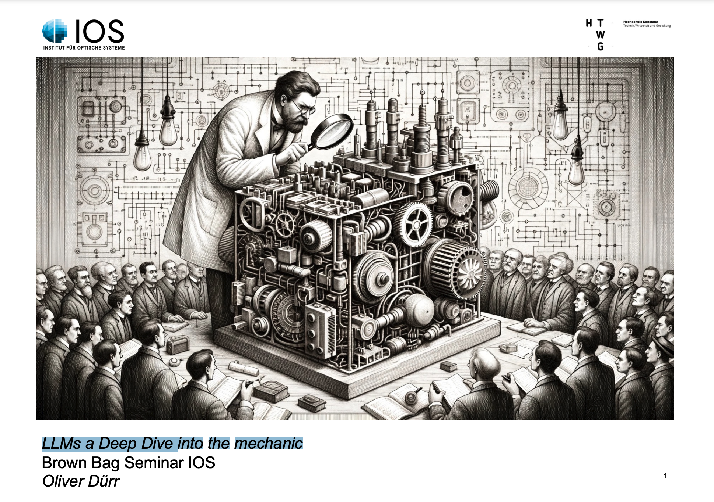
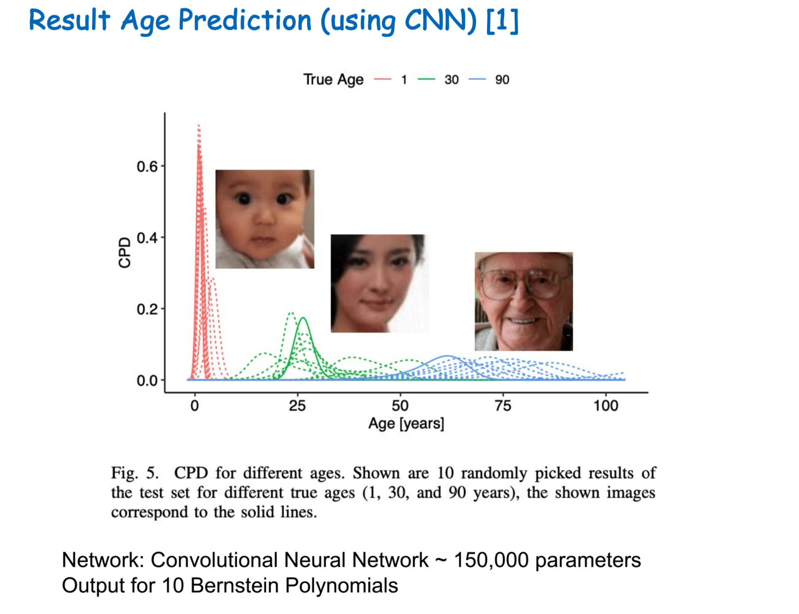
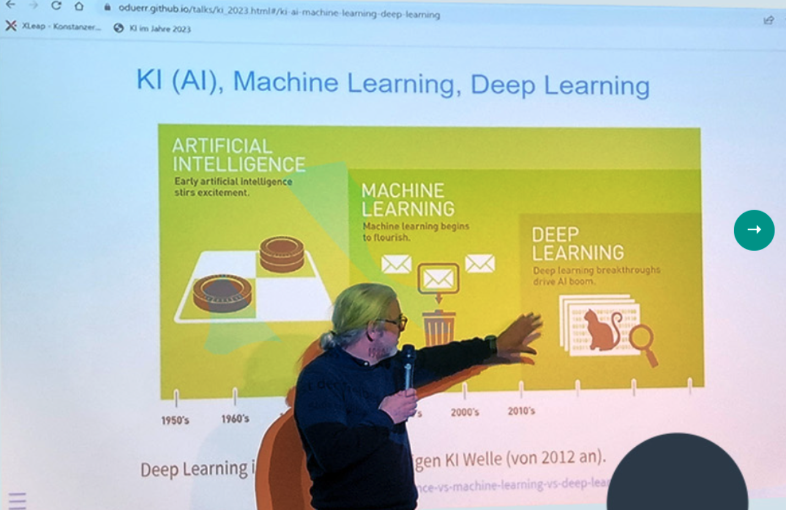

# Talks

## Recent

(November 2023) LLMs a Deep Dive into the mechanic of LLMs [slides](https://ioskn.github.io/bbs/), [video](https://video.htwg-konstanz.de/Panopto/Pages/Viewer.aspx?id=0865c105-ffee-445d-a566-b0a70107e047) 

(March 2023) Neural network-based transformation models for prediction and inference [slides](https://www.dropbox.com/s/jf0gxpmm99fuucx/kneib_OD_BS.pdf?dl=0).

(March 2023) KI im Jahre 2023 [slides](https://oduerr.github.io/talks/ki_2023.html).

I gave several talks in the brownbag seminars of [Winterthur](https://tensorchiefs.github.io/bbs/) and [Konstanz](https://ioskn.github.io/bbs/). A collection of 
[older talks](https://github.com/oduerr/blogs/old_talks.html).

# A somewhat random collection of post like documents 

* [Notes on Rotations and Quaternions](https://oduerr.github.io/gesture/Note_on_Quaternion.html) Still needs some copy editing and checking
* [How to ceate a website using quarto](https://oduerr.github.io/gesture/website_creation.html)
* [Calculating the oriantation of an IMU](https://oduerr.github.io/gesture/rotations_for_IMU.html)

<h3>Other/older</h3>
  <ul class="posts">
    
      <li>{{ post.date | date_to_string }} » <a href="{{ post.url }}" title="{{ post.title }}">{{ post.title }}</a></li>
    
  </ul>

