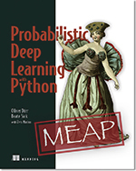

<h2>{{ page.title }}</h2>
Our Book on probabilistic deep learning is finally out as an early access version (2 chapters published 5 more to come). In a nutshell, it's deep learning as curve-fitting. 

The first chapters explain "standard" deep learning using the maximum likelihood principle. Later chapters will also include a Bayesian approach to deal with uncertainty. Go and check it out! :-) 

https://www.manning.com/books/probabilistic-deep-learning-with-python
 You can find the Jupyter notebooks here:
https://tensorchiefs.github.io/dl_book/

A selection of recent research projects. 





