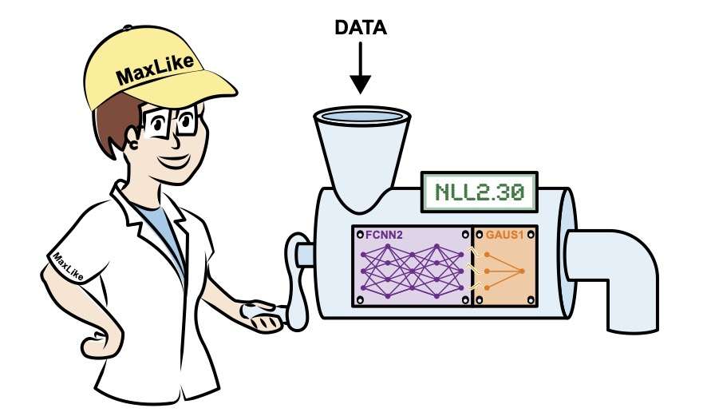

# Research Interest
The main focus of my current research is the combination of deep learning and probabilistic models (as shown in the following cartoon) 

    
      as well as Bayes, and causality. 

## Publications
Please visit my [google scholar site](https://scholar.google.ch/citations?user=T8hH3TMnFPwC&hl=de) for the latest list. My OrcidID is [orcid.org/0000-0003-2271-8630](https://orcid.org/0000-0003-2271-8630)

# A selection of recent work






