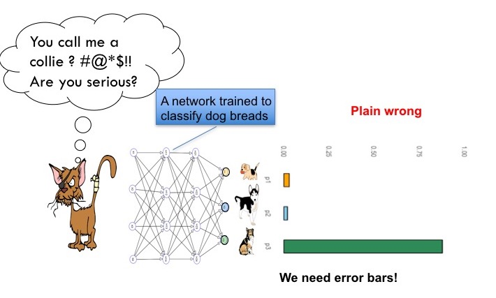

# Research Interest

    

The main focus of my current research is the combination of deep learning and statistics. 
This includes using **a) deep learning to model uncertainty**, **b) modeling the uncertainty of deep learning models** and **c) combining deep learning and statistical models**.  

## a) Using deep learning to model uncertainty
Predictions in complex systems are often uncertain in a principled way. You can't predict the weather tomorrow exactly, but you can predict the probability of rain. This uncertainty can be easily modelled in deep learning frameworks. The network outputs a probability distribution instead of a single value. This kind of probability is also referred to as aleatoric uncertainty. We contribute to this field by developing [deep transformation models](https://scholar.google.ch/citations?view_op=view_citation&hl=de&user=T8hH3TMnFPwC&sortby=pubdate&citation_for_view=T8hH3TMnFPwC:mB3voiENLucC) allowing flexible output distribuitons and extended the method to include [interpretable traditional statistical regression models](https://www.sciencedirect.com/science/article/abs/pii/S003132032100443X). We applied these models to predict the [day ahead power consumption](https://ieeexplore.ieee.org/abstract/document/10066318) or [medical applications](https://onlinelibrary.wiley.com/doi/abs/10.1002/bimj.202100379). 

## b) Modeling the uncertainty of deep learning models
Recently deep neural networks have become standard in many areas. However, they can be spectacular wrong. 
E.g. consider the case, where a network should classify an image of a class it never saw before. Technically speaking the image class is not in training set. This is shown in the following picture, where a network trained on dogs is shown a cat. 
  The network overconfidently assigns a high probability to the wrong class. I get scared when I think of self driving cars being overconfident. This kind of uncertainty is also referred to as epistemic uncertainty. Standard networks cannot state their uncertainty of a prediction, novel methods allow to include uncertainty information. Bayesian Statistics would be a perfect framework to include this kind of uncertainty. However, it is computationally expensive. We have advanced this field by developing variational inference models for flexible posterior distributions ([Bernstein Flows for Flexible Posteriors in Variational Bayes](https://arxiv.org/abs/2202.05650)), even faster approximations to existing Bayesian approximations ([single shot dropout](https://arxiv.org/abs/2308.12785)), and subspace inference methods allowing to do MCMC sample in a low dimensional proxy space of the very high dimensional network space ([Bayesian Semi-structured Subspace Inference](https://scholar.google.ch/citations?view_op=view_citation&hl=de&user=T8hH3TMnFPwC&sortby=pubdate&citation_for_view=T8hH3TMnFPwC:D03iK_w7-QYC)). We applied these methods in various fields to develop to practical applications. In high content screening [robust deep learning approach in the presence of unknown phenotypes](https://www.liebertpub.com/doi/10.1089/adt.2018.859), medical applications ([Deep transformation models for functional outcome prediction after acute ischemic stroke](https://onlinelibrary.wiley.com/doi/abs/10.1002/bimj.202100379) and [Integrating uncertainty in deep neural networks for MRI based stroke analysis](https://www.sciencedirect.com/science/article/abs/pii/S1361841520301547)). 

## c) Combining deep learning and statistical models
While deep learning excels in the prediction of complex patterns, statistical models are often more interpretable. We developed methods to combine both worlds. Most of the papers cited above also included a "little" statistical model which can be interpreted. 

<!-- ## Book on probabilistic deep learning
To foster the wider application of these methods, we also wrote a [book on probabilistic deep learning](https://www.manning.com/books/probabilistic-deep-learning-with-python). The book is a practical guide to the application of probabilistic deep learning models. The notebooks are freely available [here](https://tensorchiefs.github.io/dl_book/).

    

  -->
