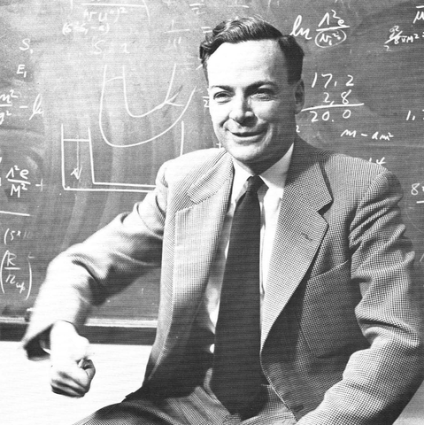

{: .center-image width="200px"}

> "What I cannot create, I do not understand."  
> \-- R. Feynman

Welcome to my teaching page! As an educator in data science, machine learning, and statistics, my philosophy is deeply rooted in a hands-on, creation-focused approach. I firmly believe that profound comprehension of the subject matter arises from application and construction. This philosophy has guided my course design and enabled me to cultivate an engaging, experiment-based learning environment. Here, students are actively challenged to build and experiment, equipping them with the essential skills needed for their future careers.

# Current Teaching

## Bachelor and Masterthesis at HTWG
* Information for potential Bachelor and Master Students [link](https://oduerr.github.io/teaching/bama/) 
* Lists of Supervised Students [link](https://oduerr.github.io/teaching/bama/bama_htwg.html)

## Courses at HTWG (2018-)
* Statistik (Bachelor)  [moodle](https://moodle.htwg-konstanz.de/moodle/course/view.php?id=3632)
* BI (Bachelor) [moodle](https://moodle.htwg-konstanz.de/moodle/course/view.php?id=1296)
* Machine Learning (Master) [moodle](https://moodle.htwg-konstanz.de/moodle/course/view.php?id=1330)
* Deep Learning (Master) [moodle](https://moodle.htwg-konstanz.de/moodle/course/view.php?id=3032)
* Data Science (Master) [moodle](https://moodle.htwg-konstanz.de/moodle/course/view.php?id=3370)
* Data Analysis (Master) [moodle](https://moodle.htwg-konstanz.de/moodle/course/view.php?id=2564)

## Continous Education
Together with Beate Sick I teach the following courses.

* Deep Learning (CAS Machine Intelligence, ZHAW Winterthur) from 2017- (yearly)
  * [https://tensorchiefs.github.io/dl_course_2023/](https://tensorchiefs.github.io/dl_course_2023/) 

*  Deep Learning: A Probabilistic Approach (DAS and CAS in Applied Statistics, ETH Zurich) from 2020- (every 2nd year)
   * [Course](https://www.vorlesungen.ethz.ch/Vorlesungsverzeichnis/lerneinheit.view?lerneinheitId=163848&semkez=2022W&lang=en) [https://tensorchiefs.github.io/dl_rcourse_202/](https://tensorchiefs.github.io/dl_rcourse_202/)

# Courses at ZHAW (2013-2018)

* Wahrscheinlichkeit und Statsistik (WaST, Bachelor)
  * WaST1 Descriptive Statistik 2 ECTS 
  * WaST2 Wahrscheinlichkeitsrechung 4 ECTS 
  * WaST3 Schliessende Statistik 6 ECTS 
* Stochastische Prozesse (Bachelor)
* Statistical Datamining (Bachelor)
* Machine Learning (Master)

Bachelor, Project Thesis and Master Thesis supervised at the ZHAW [link](bama/bama_zhaw.html)

## Continous Education 
Teaching done for the master of Advanced Studies (MAS Data Science) and certificate of Advanced Studies (CAS Data Science Applications)

* Deep Learning 8 4h lectures for CAS Machine Perception together with Beate Sick [tensorchiefs.github.io/dl_course/](https://tensorchiefs.github.io/dl_course/), Spring 2017
* (Social-) Network Analysis 5 4h lectures for the [CAS Statistical Modelling](https://weiterbildung.zhaw.ch/de/school-of-engineering/programm/cas-statistical-modelling.html), Spring 2017
* Big Data Visualization in the [CAS Data Science Applications](http://www.weiterbildung.zhaw.ch/de/school-of-engineering/programm/cas-data-science-applications.html) Fall 2015
  + day 1 (ggplot) [slides](https://www.dropbox.com/s/ekhy8zx0vs0wz84/big_data_vis_day1.pdf?dl=1)
  + day 2 (visualization of high-dimensional data) [slides](https://www.dropbox.com/s/yf7lwr2p7jhufqh/big_data_vis_day2.pdf?dl=1)
  + day 3 (introduction to network analysis) [slides](https://www.dropbox.com/s/alzqatgd3jaocuj/big_data_vis_day3.pdf?dl=1)
* Deep Learning in the [CAS](http://www.weiterbildung.zhaw.ch/de/school-of-engineering/programm/cas-data-science-applications.html) Fall 2016 [slides](https://www.dropbox.com/s/ebh3jlbmicfext2/Deep_Learning_CAS.pdf?dl=1) [github](https://github.com/oduerr/dl_cas)

# Other 
* Tutorials on deep learning, especially using TensorFlow [github repository](https://github.com/oduerr/dl_tutorial)
* A tutorial session for teachers in data analysis based on our booklet: [Datenanalyse; Anregungen zur Umsetzung der "Datenanalyse" im eidg. Rahmenlehrplan 2012 für die Berufsmaturität](https://dl.dropboxusercontent.com/u/9154523/paper/bms-broschuere-datenanalyse-sick-d%C3%BCrr.pdf); Beate Sick, Oliver Dürr

 

